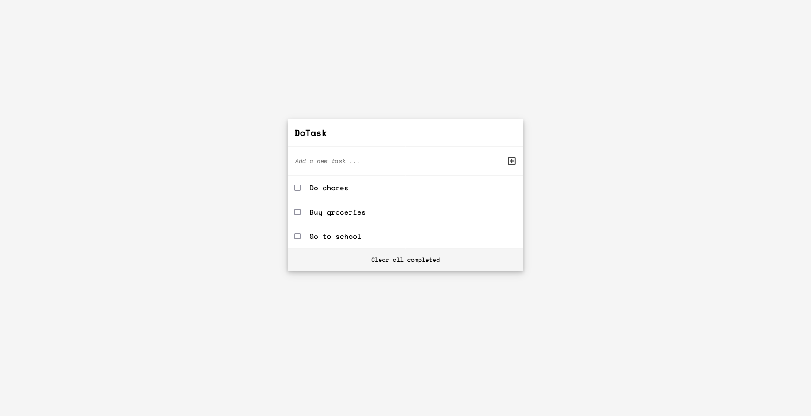

# DoTask

> "DoTask" is a tool that helps to organize your day. It simply lists the things that you need to do and allows you to mark them as complete.

<br>



<br>

**Additional description about the project and its features.**

## ⚒️ Built With

`Languages`

- HTML
- CSS
- Javascript

`Frameworks`

- SASS
- Webpack

## 📡 Live Demo

[Link to Live Demo](https://yaseerokino.github.io/dotask/)

## 🧰 Tools

The following tools help make it easier to run this code.

- [Visual Studio Code](https://code.visualstudio.com/): A source code editor
- [git](https://git-scm.com/downloads): A tool for managing source code

## 🔥 Getting Started

### **Prerequisites**

To run this project you need [Node](https://nodejs.org/en/) and [NPM](https://docs.npmjs.com/about-npm-versions) installed on your local machine
<br>
`Note` : When you install Node.js, npm is automatically installed, However, npm is released more frequently than Node.js

### **Setup**

If you have installed git you can clone the code to your machine, or download a ZIP of all the files directly.
[Download the ZIP from this location](https://github.com/yaseerokino/dotask/archive/refs/heads/main.zip), or run the following [git](https://git-scm.com/downloads) command to clone the files to your machine:

```bash
git clone https://github.com/yaseerokino/dotask.git
```

### **Install**

Once the files are downloaded or cloned on your machine, open your terminal and ` "cd to dotask folder"` and run the following commands:

**To install all dependencies**

```bash
npm install
```

**To build and configure webpack**

```bash
npm run build
```

**To start development server**

```bash
npm run start
```

## 🙎🏾‍♂️ Author

- GitHub: [@yaseerokino](https://github.com/yaseerokino)
- Twitter: [@yaseerokino](https://twitter.com/yaseerokino)
- LinkedIn: [Yaseer Okino](https://linkedin.com/in/yaseerokino)

## 👊🏾 Show your support

Give a ⭐️ if you like this project!

## 📝 License

This project is [MIT](./LICENSE) licensed.
